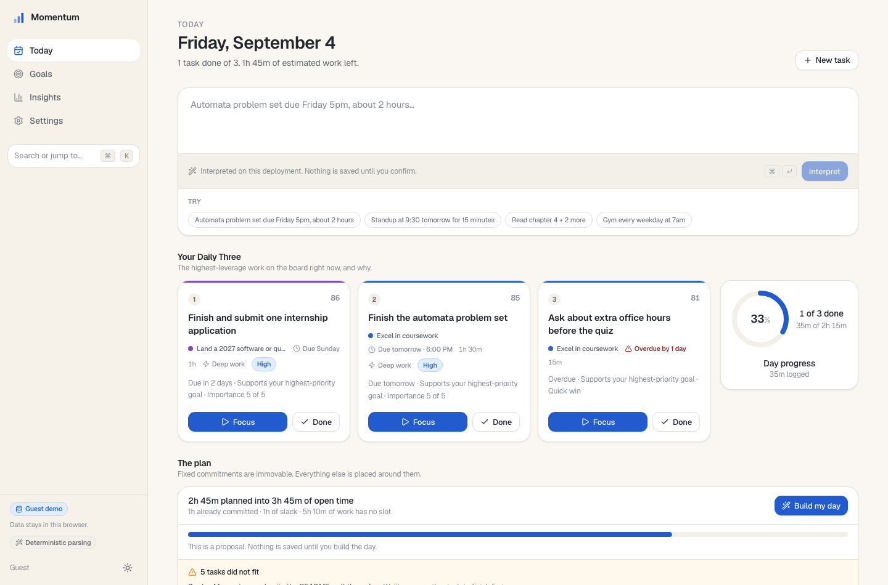
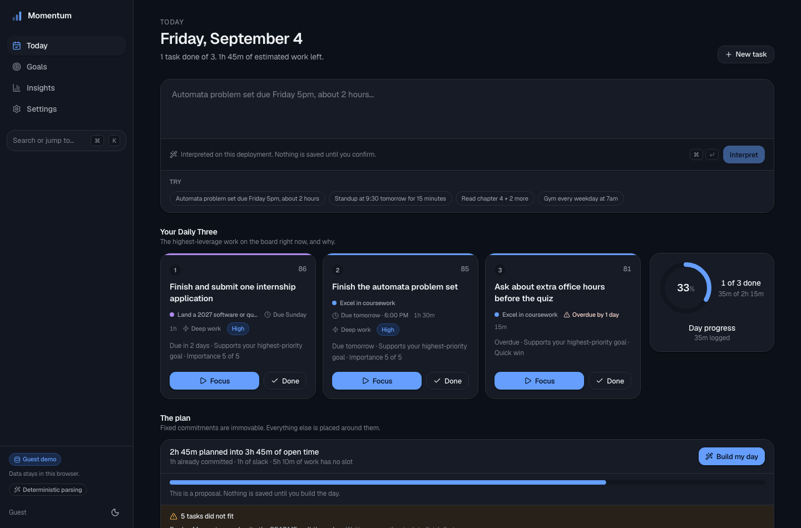
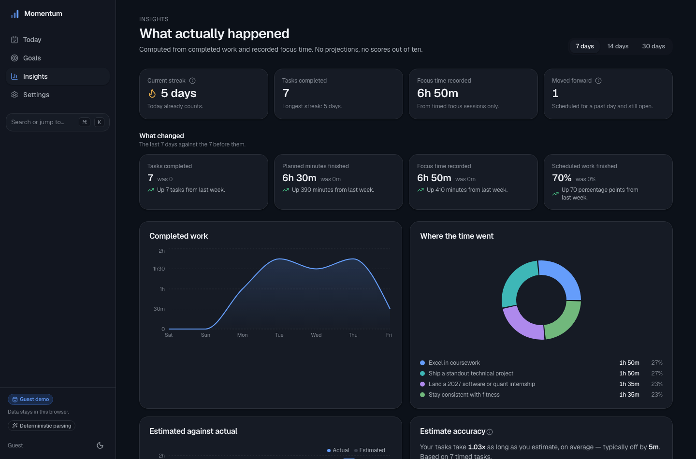
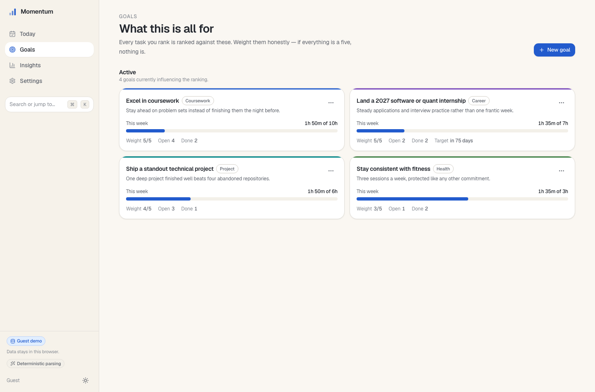
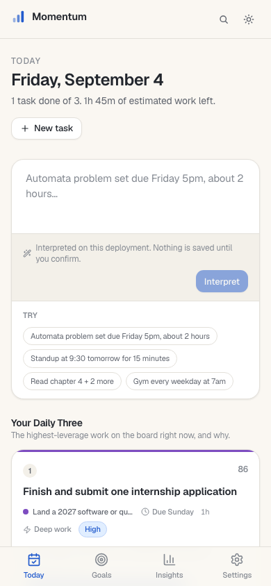
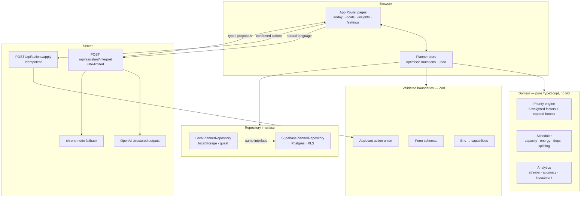

<div align="center">


# Momentum

**Turn a brain dump into a realistic day.**

Capture work in plain language, rank it against your long-term goals, and get a
time-blocked day that fits the hours you actually have.

[Run it locally in 30 seconds](#run-it-locally) · [How the algorithms work](#the-two-algorithms) · [Why AI never writes to the database](#why-ai-never-writes-to-the-database)

</div>

---

## The problem

Every to-do app is happy to hold 200 tasks. None of them will tell you that the
seven things you starred for today add up to eleven hours.

So the list grows, priority becomes a feeling, and the plan is fiction. Two
failures compound:

1. **Capture has friction.** Structuring a thought into title, duration,
   deadline, and project is more work than having the thought, so it doesn't get
   captured — or it gets captured as an untyped scrap.
2. **Nothing connects today to what you're actually trying to do.** A task
   belonging to a goal you care about and one that belongs to nothing look
   identical in a flat list.

Momentum addresses both, and refuses to lie about capacity.

## What it does

You type the way you'd talk:

> `Automata problem set due Friday 5pm, about 2 hours. Standup at 9:30 tomorrow
for 15 minutes. Gym every weekday at 7am.`

That becomes three typed, editable proposals — a deadline, a fixed meeting, and
a recurring commitment — which you confirm or discard. Nothing is written until
you do.

Then two deterministic engines take over. Every task gets a **0–100 priority
score you can open up and read**, and the day is laid out by a **capacity-aware
scheduler** that plans only what fits and names, individually, the work that
didn't.

|                              |                                                                                                                                   |
| ---------------------------- | --------------------------------------------------------------------------------------------------------------------------------- |
| **Natural-language capture** | Type or paste a brain dump. Get typed actions with a preview you can edit before anything is saved.                               |
| **Explainable priorities**   | Six weighted factors plus capped boosts. Every score expands into the arithmetic that produced it.                                |
| **Capacity-aware planning**  | Fixed commitments are immovable. Deep work goes in your peak-energy window. Long tasks split. Overflow is reported with a reason. |
| **Daily Three**              | The three highest-leverage tasks, surfaced with why they won.                                                                     |
| **Focus timer**              | Recorded time feeds estimate-accuracy analytics, so "2 hours" gets calibrated against reality.                                    |
| **Insights**                 | Completed work, where time went by goal, estimated against actual, and how far off your estimates run.                            |
| **Goals**                    | Long-term goals with importance weights; the thing that makes task ranking mean something.                                        |

### The core flow

```
brain dump  →  typed proposals  →  you confirm  →  ranked queue  →  time-blocked day
                     ↑                                   ↑                 ↑
                AI or chrono                    priority engine       scheduler
                 (validated)                    (explainable)      (capacity-aware)
```

## Screenshots

|                                                                                                        |                                                                             |
| ------------------------------------------------------------------------------------------------------ | --------------------------------------------------------------------------- |
|  |             |
| **Today** — capture, the Daily Three, and the day drawn to scale.                                      | **Dark mode** — a designed theme, not an inversion.                         |
|    |  |
| **Insights** — what actually happened. No projections, no scores out of ten.                           | **Goals** — importance weights that drive task ranking.                     |

<div align="center">


_Responsive down to 390px, with a bottom nav and 44px touch targets._
</div>

## Run it locally

Guest Demo mode needs no account, no database, and no API key. It seeds a
realistic dataset relative to today's date and persists to `localStorage`.

```bash
git clone https://github.com/a-gupta123/momentum.git
cd momentum
npm install
npm run dev
```

Open <http://localhost:3000> and click **Try the live demo**. That's the whole
setup.

## Architecture

The load-bearing decision is that **the domain layer is pure TypeScript with no
knowledge of React, the network, or the database**. Priority and scheduling are
functions from data to data, which is why they can be unit-tested exhaustively
and why the same code runs against `localStorage` and Postgres.



### Layers

| Path                   | Responsibility                                                                                     |
| ---------------------- | -------------------------------------------------------------------------------------------------- |
| `lib/domain/`          | Priority, scheduling, recurrence, analytics, dates. Pure. No imports from `app/` or `components/`. |
| `lib/domain/tuning.ts` | Every weight, threshold, and limit in one reviewable file.                                         |
| `lib/validation/`      | Zod schemas for forms, AI output, env, and API bodies.                                             |
| `lib/repositories/`    | One interface, two implementations (`local`, `supabase`).                                          |
| `lib/ai/`              | Prompt construction, structured-output plumbing, deterministic fallback parser.                    |
| `components/planner/`  | The Today surface: composer, timeline, queue, focus timer.                                         |
| `supabase/migrations/` | Schema, RLS policies, and RPC functions for atomic mutations.                                      |

## The two algorithms

### Priority: a score you can read

Each task gets a weighted sum of six normalized factors, then capped additive
boosts, clamped to 0–100. Weights live in
[`lib/domain/tuning.ts`](lib/domain/tuning.ts) and are asserted to sum to 1 by a
unit test.

| Factor           | Weight | What it measures                                                                                                     |
| ---------------- | -----: | -------------------------------------------------------------------------------------------------------------------- |
| Deadline urgency |   0.32 | Ramps from 0 at 14 days out to 1 at the deadline. Undated work gets 0.22 so it stays rankable rather than invisible. |
| Goal alignment   |   0.25 | The linked goal's importance, scaled by goal status.                                                                 |
| User importance  |   0.18 | Your 1–5 rating.                                                                                                     |
| Manual priority  |   0.10 | Low / normal / high / urgent.                                                                                        |
| Age              |   0.08 | Saturates after 14 days, so old work surfaces without dominating.                                                    |
| Effort fit       |   0.07 | Favors tasks that fit a real sitting: 1 at ≤15 min, 0 at ≥180 min.                                                   |

Then: **+2.5/day overdue** (capped at +10), **+6** due today, **+4** already in
progress. Boosts are additive and capped rather than folded into urgency, so the
UI can show them as explicit, bounded nudges.

Two decisions worth defending:

- **The overdue boost is capped.** Uncapped, a task forgotten for six months
  outranks everything forever, and you learn to ignore the top of your list.
- **Every score is auditable.** "Why this rank" expands into the actual factor
  values and boosts. A number you can't interrogate is a number you won't trust,
  and an opaque ranking is indistinguishable from a broken one.

`SCORE_VERSION` is stamped onto every saved plan. When weights change, old plans
keep an honest record of the rules that produced them.

### Scheduler: a plan that fits

A greedy pass over priority order with a bounded improvement phase — chosen over
an optimal solver because the constraints are soft, the input changes constantly,
and a plan you can predict beats a plan that's 4% better and mysterious.

1. **Fixed commitments are placed first and never move.** A meeting at 09:30 is
   a fact, not a preference.
2. **Capacity is measured from now, not from the start of the workday.** At 3pm
   the scheduler has the rest of the afternoon, not the whole day. Anything else
   is arithmetic that flatters you.
3. **Deep work targets your energy window.** Tasks at or above importance 4
   prefer your declared peak hours.
4. **Dependencies gate placement.** A blocked task stays out of the plan until
   its prerequisites are done.
5. **Long tasks split.** Above 90 minutes, into chunks of 30–90 minutes, when the
   task allows it.
6. **Breaks are inserted** between long stretches.
7. **Overflow is named.** Work that didn't fit is listed individually with a
   reason: no slot before the deadline, blocked by a prerequisite, out of hours.

Everything snaps to a 15-minute grid. A plan at 09:07 is not a plan anyone asked
for.

The scheduler enforces deadlines strictly: it will report a task as overflow
rather than schedule it past its own due date.

## Why AI never writes to the database

The AI layer converts language into **typed proposals**. It cannot mutate
anything.

```
input → OpenAI structured outputs → Zod validation → editable preview → your confirmation → repository
                       ↓ (unset, or fails)
                  chrono-node parser
```

Concretely:

- **Structured outputs, then validated anyway.** Every response is parsed
  against a Zod discriminated union. Schema-conformant nonsense — a duration of
  −5, a goal id that doesn't exist — is rejected at the boundary.
- **The preview is editable and every action is individually deselectable.** The
  model proposes; you decide.
- **Nothing degrades when it's absent.** Without `OPENAI_API_KEY`, capture falls
  back to a deterministic `chrono-node` parser. Every feature still works.
- **User text is delimited and never trusted as instruction.** Task content is
  data, not prompt.
- **The API key is server-only.** No `NEXT_PUBLIC_` prefix, no client-side
  OpenAI calls.

This is a correctness argument, not a philosophical one. A model that writes
directly to your planner turns a plausible-sounding hallucination into data
corruption you have to find and undo by hand.

## Data and privacy

- **Guest mode never leaves the browser.** No network calls, no account, no
  telemetry. `localStorage` only, with versioned state migration so a schema
  change degrades gracefully instead of throwing away your data.
- **Signed-in mode is protected by row-level security.** Every table has RLS
  policies scoped to `auth.uid()`. Authorization is in the database, not in
  application code that could forget a `where` clause.
- **Mutations are atomic.** Multi-table writes go through Postgres RPC functions
  so a partial failure can't leave a half-applied plan.
- **Optimistic concurrency.** Writes carry an `updated_at` precondition
  (`timestamptz(3)`) and are rejected if the row moved underneath them, so a
  stale tab can't silently overwrite newer edits.
- **Task text is never logged.** API routes return typed error codes and log
  nothing containing user content — the surest way not to leak private text into
  a log aggregator is not to write it there.
- **Task text is rendered as text.** No `dangerouslySetInnerHTML` anywhere.

## Configuration

Every variable is optional. See [`.env.example`](.env.example) for the annotated
version. Presence of these values is parsed into a typed capability object
(`lib/validation/server-env.ts`) that the UI reflects in the sidebar mode badge.

| Variable                               | Scope           | Effect when set                                                                                           |
| -------------------------------------- | --------------- | --------------------------------------------------------------------------------------------------------- |
| `NEXT_PUBLIC_SUPABASE_URL`             | client          | With the key below: enables auth and the Postgres adapter.                                                |
| `NEXT_PUBLIC_SUPABASE_PUBLISHABLE_KEY` | client          | Publishable anon key. Powerless without a session because of RLS.                                         |
| `OPENAI_API_KEY`                       | **server only** | With the model below: upgrades capture from the deterministic parser to structured-output interpretation. |
| `OPENAI_MODEL`                         | **server only** | Model id. Not defaulted — model names get retired.                                                        |
| `NEXT_PUBLIC_APP_URL`                  | client          | Absolute origin for OAuth redirects and Open Graph. Defaults to `http://localhost:3000`.                  |

Capability rules: no Supabase variables → Guest Demo is the default path.
Both → auth and the production adapter become available. Both OpenAI variables →
enhanced parsing. Missing secrets produce actionable setup copy and never
disclose _why_ something is unconfigured.

### Optional: Supabase

```bash
supabase link --project-ref <your-ref>
supabase db push          # applies schema, RLS, and RPC migrations in order
```

Then set both `NEXT_PUBLIC_SUPABASE_*` variables and add
`<your-app-url>/auth/callback` to the project's allowed redirect URLs. Sign-in is
a magic link; there is no password to store or leak.

### Optional: OpenAI

Set `OPENAI_API_KEY` and `OPENAI_MODEL` to a current model supporting structured
outputs. The AI endpoint is rate-limited per session with a fixed-window
counter. That counter is in-memory: it is correct for a single instance and
documented as a development-grade fallback, not a distributed limiter. A
multi-instance deployment should swap in a durable store — the module is
isolated to make that a one-file change.

## Scripts

| Command                 | What it does                        |
| ----------------------- | ----------------------------------- |
| `npm run dev`           | Dev server.                         |
| `npm run build`         | Production build.                   |
| `npm run lint`          | ESLint.                             |
| `npm run typecheck`     | `tsc --noEmit` in strict mode.      |
| `npm run test`          | Vitest unit tests.                  |
| `npm run test:coverage` | Unit tests with coverage.           |
| `npm run e2e`           | Playwright. Requires a build first. |
| `npm run format:check`  | Prettier check.                     |
| `npm run verify`        | Everything CI runs, in order.       |

## Test strategy

Tests are concentrated where bugs are both likely and expensive: the pure domain
layer, and the flows a recruiter will actually click.

**246 unit tests** (Vitest) cover the domain layer directly, no mocks needed
because it has no I/O:

- Priority: factor math, weight normalization, boost caps, dependency blocking.
- Scheduler: capacity, fixed-block collisions, deep-work windows, splitting,
  deadline enforcement, overflow reasons.
- Dates and recurrence: DST transitions, timezone boundaries, RRULE expansion.
- Analytics: streaks, estimate accuracy, week-over-week deltas.
- Guest state: versioned migration, corrupt-payload recovery.
- Local repository: optimistic-concurrency rejection, recurrence successors.

**66 end-to-end tests** (Playwright) run against a production build in Guest
Demo mode, so CI needs no secrets:

- Capture: brain dump → proposals → selective confirmation → tasks exist.
- Planner: complete a task, edit through the detail sheet, add via the form,
  survive a reload.
- Navigation: every route renders its own content and heading.
- Layout: no horizontal overflow at 390/768/1280/1440, pages actually scroll,
  mobile nav clears 44px, dark mode is a real theme.

An opt-in screenshot suite (`E2E_SHOTS=1`) regenerates the images above.

## Deployment

**Vercel:** import the repo, add the environment variables you want, deploy.
The build succeeds with everything unset — that configuration is exercised in
CI on every push.

**Supabase:** run `supabase db push` against the linked project, then add
`https://<your-domain>/auth/callback` to the allowed redirect URLs and set
`NEXT_PUBLIC_APP_URL` to the deployed origin.

CI ([`.github/workflows/ci.yml`](.github/workflows/ci.yml)) runs format, lint,
typecheck, unit tests, and build on Node 22, plus the full end-to-end suite
against a production build.

## Tradeoffs

Things I chose, and what I gave up:

- **Greedy scheduling over constraint solving.** Predictable and fast, and it
  explains itself. A solver would produce marginally tighter days that are hard
  to reason about when they surprise you.
- **Hand-written Supabase types over generated ones.** No codegen step in the
  toolchain; the cost is that they must be updated alongside migrations.
- **In-memory rate limiting and idempotency.** Correct for a single instance,
  honest about it in the code and here. Both are isolated modules so a Redis
  swap touches one file each.
- **`localStorage` for guest mode.** Zero-friction evaluation, and privacy by
  construction. The cost is no cross-device sync without signing in.
- **A design system instead of default shadcn.** OKLCH tokens, a real dark
  theme, tabular numerals throughout. More initial work, but the product doesn't
  look like a template.
- **Unit tests on the domain, e2e on the flows, and no component tests.** The
  middle layer is where tests cost the most and catch the least; the two ends
  cover the same ground more cheaply.

## Scoped future work

Deliberately out of scope, not forgotten:

- **Calendar sync.** Two-way Google Calendar so fixed commitments come from your
  real calendar. The scheduler already treats fixed blocks as immovable, so this
  is an adapter, not a redesign.
- **Learned duration estimates.** The estimate-accuracy analytics already
  compute a per-user ratio; feeding it back as a suggested duration is the
  natural next step.
- **Durable rate limiting** via Upstash Redis.
- **Generated database types** wired into CI to catch migration drift.
- **Collaborative goals** — shared goals with per-user task ownership. This one
  is a real redesign: RLS policies currently assume single ownership.

## License

MIT — see [LICENSE](LICENSE).
